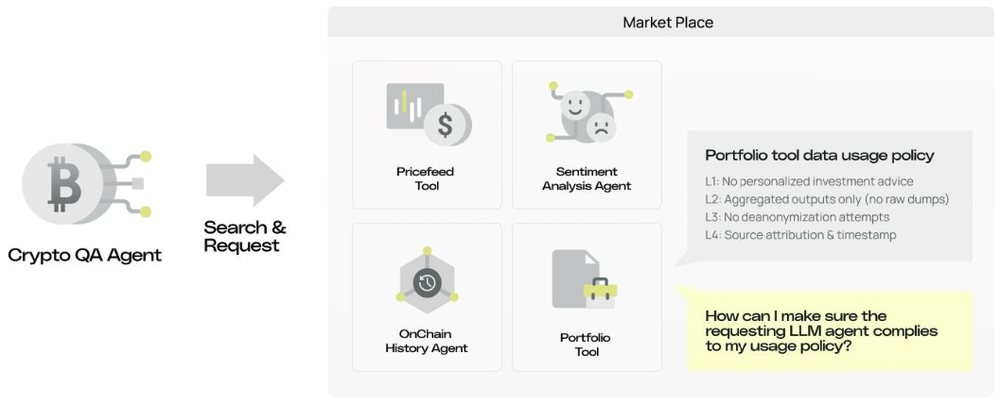
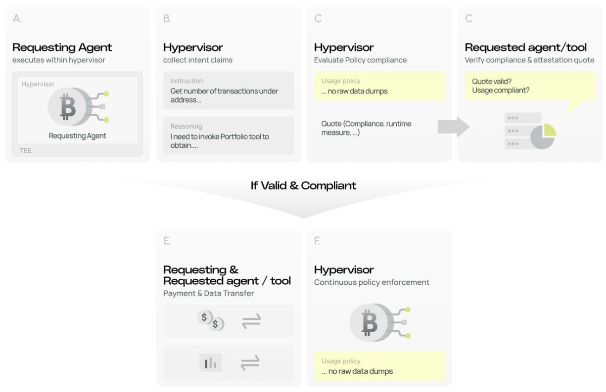

# Programmable Governance for Programmable Agent Workflows

The x/function/customized-policy adds a programmable rules layer that lets providers define and enforce “terms of use” for their data, models, and tools.

## Disclaimers

This code is for demonstration and testing purposes only. 


## Demo Scenario

In this demo, we deploy a cryptocurrency question-answering LLM agent that processes crypto-related queries from users. The agent has access to a synthetic marketplace where four synthetic tools provide various cryptocurrency data and analytics services.

Each tool provider seeks to ensure their data is used in a safe and compliant manner by the requesting agent. To enforce this, they define data usage policies that govern how their tools can be invoked. This synthetic environment and the objectives are illustrated below.


<p align="center">

</p>

With the x/function/customized protocol, asset owners (tool providers) can cryptographically verify:

1. **Integrity of Policy Compliance Checking**: A trusted policy compliance function is correctly applied to evaluate whether the requesting agent's intended actions comply with the specified policies.
2. **Integrity of Policy Enforcement**: A trusted policy enforcement mechanism is correctly applied during agent execution, enforcing that only compliant tool calls are executed.


## Workflow


In this implementation, the agent execution, policy compliance checking, and policy enforcement are all managed by an open-source hypervisor $H$ running within a Trusted Execution Environment (TEE). After compliance checks pass, the hypervisor generates TEE attestation quotes containing the compliance results and passes them to the tools before invocation. By verifying the RTMR (Runtime Measurement Register) values and quote signatures in these attestations against the expected open-source hypervisor measurements, tool providers can cryptographically verify:

1. The hypervisor's code integrity (via RTMR matching the known open-source build)
2. That proper compliance checks were performed before their tools were invoked
3. That the same hypervisor will continue to enforce policies after tool execution

This provides end-to-end assurance that policies are both checked before and enforced after tool invocation.

The workflow is illustrated as follows.

<p align="center">

</p>


## Quick start

### Hardware requirements

To run the demo, ensure you run on hardwares that support Intel Trust Domain Extensions (TDX). We experiment on Google Cloud c3-standard-4 instance with Intel Sapphire Rapids CPUs and Confidential VM service enabled. 

Please note that, to cryptographically prove the hypervisor's integrity, you have to build a custom VM image with the hypervisor $H$ and all dependencies embedded and obtain its measurement. This is not included in this repository. See [here](#extra-workflows) for details. Please also note as the demo calls OpenAI APIs, the queries and the outputs are not confidential to OpenAI.

### Setting up the environment

```
# Install Rust 1.91.1
rustup toolchain install 1.91.1

# Install system dependencies
# Ubuntu/Debian:
sudo apt-get install build-essential pkg-config libssl-dev python3 python3-pip

# macOS:
brew install openssl pkg-config python3

# Install Python dependencies for examples
pip3 install coincurve cryptography requests

export OPENAI_API_KEY=<YOUR_OPENAI_API_KEY>
```


### Launching the hypervisor

```
cargo run --bin hypervisor -- --config hypervisor.toml
```

### Running example queries to the crypto QA agent
```
python examples/crypto_agent_client.py
```

See `outputs/results_example.txt` for an example of the outputs by running the example queries.

## Example Walkthrough

When executing the example queries, you may notice the agent returns a failure message for certain requests. This demonstrates how policy compliance checking and enforcement works.

For example, consider the query:

```
Query: Show me the transaction history for address 0x742d35Cc6634C0532925a3b844Bc9e7595f0bEb on Ethereum
```

The planning module of the crypto agent decides to invoke the `OnChainHistoryTool`. However, this tool specifies the following policy that prohibits raw data dumps:

```
L2: Aggregated outputs only (no raw dumps)
Description: The agent may use raw tool data internally, but user-facing outputs must be aggregated or summarized (e.g., totals, averages, ranges, counts, small illustrative snippets). It must not return large raw dumps such as full tick-by-tick feeds, long transaction lists, or full order books.                
```

The intent summarizer and the policy compliance checker (whose integrity is guaranteed by the TEE) collect evidence of the intent (the query, agent prompt, and thought process in this demo) and perform a compliance check against the policy specified by `OnChainHistoryTool`. 

Since the policy compliance check fails, the agent cannot provide an attestation of compliance. The agent's planner determines that the query cannot be processed further without the tool output, and returns a failure message:

```
Response: IMPOSSIBLE: Access to the necessary tools to retrieve the transaction history for the Ethereum address was rejected by compliance policy. Therefore, I am unable to provide the transaction history for address 0x742d35Cc6634C0532925a3b844Bc9e7595f0bEb.
```

In this way, the owner of `OnChainHistoryTool` can ensure their tool is only used in ways that comply with the specified policy. When the compliance check passes, the policy is further enforced by the policy enforcement algorithm during and after tool execution.


<a name="extra_workflows"></a>

## Caution

Please note only the *execution* of the policy compliance check and policy enforcement can be verified, not the results. Improving accuracy of the policy compliance check and effectiveness of the policy enforcement in LLM agents is an active and complementary research topic.

## Detailed workflow

### Roles
- Agent $A$: a crypto question answering agent
- Tools $B_1$-$B_K$: crypto related tools that provide synthetic crypto price, transactions, market info etc.
- Policy $P_1$-$P_K$: $B_1$-$B_K$ sets their own usage policy $P_i$ in the form of natural language.

### Process

1. LLM Agent $A$ + Hypervisor $H$ deployed on TEE.
2. User input a crypto related query $Q$.
3. Agent $A$ plans for a subset of tools that can be used to address $Q$, e.g., $B_1$, $B_2$, $B_3$.
4. **Policy compliance check**: The hypervisor $H$ collects system prompt+internal reasoning output ($R$), user query $Q$, and the tool policy $P_i$ and invokes a compliance check function $f_{pc}(R, Q, P_i)$. All inputs are natural language; $f_{pc}$ is an LLM; return boolean compliance results $PC_i$.
5. Agent $A$ may reflect whether the query processing can continue with compliant tools. If not, $A$ returns a failure message.
6. The compliance check results are quoted, signed and delivered to $B_1$, $B_2$, $B_3$ and a synthetic payment can be made. The compliant tools send back responses $C_i$.
7. **Policy enforcement**: The hypervisor $H$ enforces policy $P_i$ of the accepted tools with some enforcement algorithm $A_{pe}$. 
8. Agent $A$ continues with processing the query $Q$ with the responses $C_i$ obtained by the tools that accept the compliance. If the query cannot continue due to lack of tools / policy enforcement, return a failure message. Otherwise, return a response to the query $Q$.
9. Hypervisor $H$ can optionally generates a quote of the process above

### Extra workflow for verifying $H$

To further cryptographically prove the hypervisor's code integrity, you may have to build a custom VM image with the hypervisor 
$H$ embedded and obtain its measurement. This measurement is the "golden" measurement to compare again when a verifier verifies an attestation quote.

1. Build a custom VM image with the hypervisor H embedded (including the OS, hypervisor code, and all dependencies)
2. Obtain the measurement of this built image
3. At runtime, when the VM boots in TDX, the TDX module measures the entire VM image and stores it in RTMRs
4. When attestation quotes are generated, they include these RTMR values
5. Asset providers verify that the RTMR values in the quote match the pre-computed measurement.

