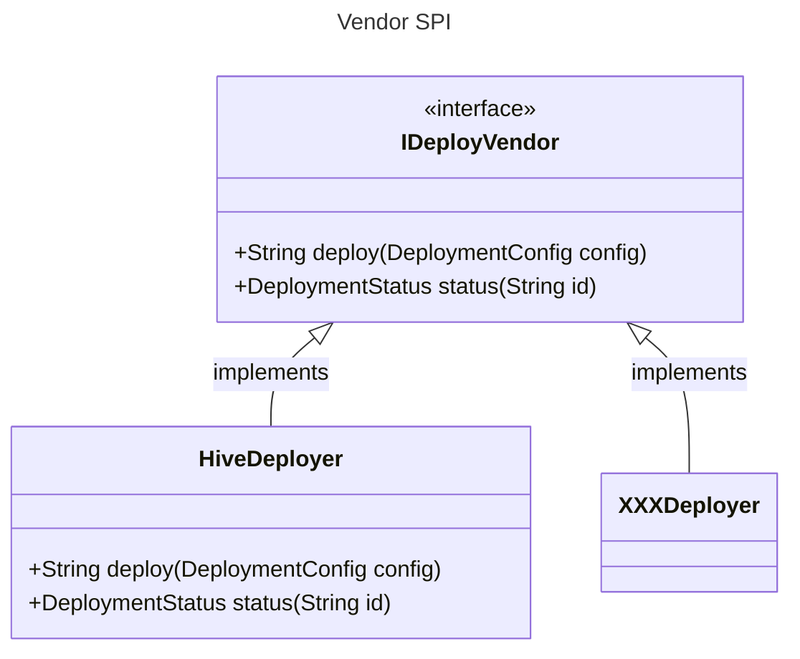
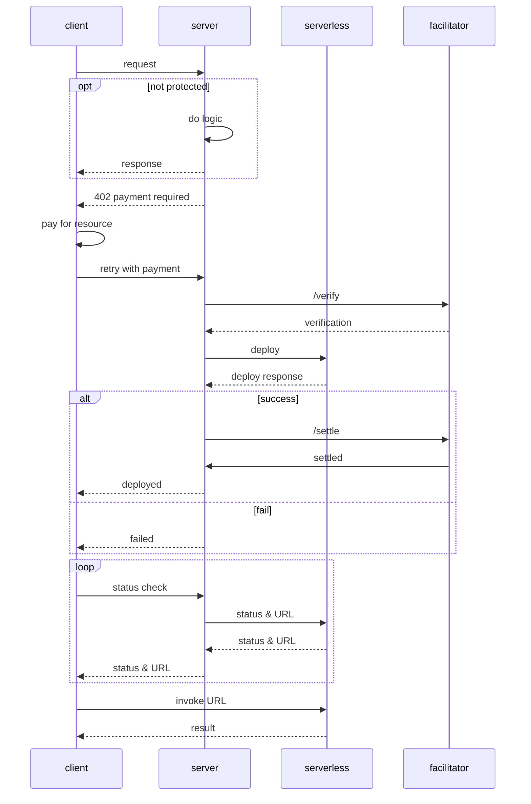

# x402 Function

An open-source backend project combined micropayment protocol and Serverless deployment. 
It enables pay-per-use API, automated service deployment, 
and flexible configuration for cloud-native environments.

## Features
- **x402 Protocol Integration**: Pay-per-use API endpoints with USDC micropayment support.
- **Serverless Deployment**: x402-function implementation with Sahara's Hive Serverless infrastructure. Automated deployment via GitHub repository to Serverless vendor. (Hive/Vercel for example)
- **Kubernetes Ready**: ConfigMap, Service, and scalable deployment yaml.

## Architecture
- **x402** for micropayments and pay-per-use API management
- **Serverless** deployment through Sahara's Hive Serverless infrastructure (extensible to other vendors)

## Diagram
### Model

### Sequence


## Quick Started

### Prerequisites
- JDK 21+
- Maven 3.8+
- Docker & Kubernetes (for cloud deployment)

### Local Development
1. Clone the repository:
   ```bash
   git clone
   ```
2. Install vendor SPI dependency:
    ```bash
    mvn clean install -DskipTests  -f ./vendor-spi/pom.xml
    ```
3. Install x402 Server SDK:
    ```bash
    mvn clean install -DskipTests  -f ./x402-spring-boot-starter/pom.xml
    ```
4. Install Hive Vendor Spring Boot Starter. (Skip if you want to develop your own vendor. Refer to the [README.md](vendor-spi/README.md))
    ```bash
    mvn clean install -DskipTests  -f ./hive-vendor-spring-boot-starter/pom.xml
    ```
5. Install x402 function Spring Boot Starter.
    ```bash
    mvn clean install -DskipTests  -f ./x402-function-parent/pom.xml
    ```
6. Run the demo backend.
    ```bash
    mvn clean spring-boot:run -f ./x402-function-rest-demo/pom.xml
    ```

Access API docs at: `http://localhost:{PORT}/doc.html` (Knife4j)

Tips: Implement the [vendor spi](./vendor-spi) to develop your own deployer. Refer to the [Hive vendor](./hive-vendor-spring-boot-starter) source code for details.

### Configuration
Configure the application via `application.properties`:
- `logging.level.root`: Sets the root logging level (e.g., DEBUG, INFO).
- `x402.enabled`: Enables or disables the x402 payment protocol for API endpoints. Set to `true` to require micropayments for protected routes.
- `x402.default-pay-to`: The default payee address (e.g., wallet address) for receiving payments.
- `x402.network`: The blockchain network identifier (e.g., `base-sepolia`) used for payment settlement.
- `x402.asset`: The contract address.
- `x402.max-timeout-seconds`: Maximum time (in seconds) to wait for payment completion before timing out.
- `x402.facilitator-base-url`: Facilitator API URL.
- `hive.api.base-url`: Base URL for Hive Serverless API.
- `hive.api.account`: Hive account identifier for API access.
- `hive.api.token`: API token for authenticating Hive requests.
- `hive.api.token-header-name`: HTTP header name for Hive API token.
- `knife4j.enable`: Enables Knife4j API documentation UI.
- `knife4j.setting.language`: Language setting for Knife4j UI.
- `app.cors.origins`: Allowed CORS origins for frontend access.
- `app.cors.methods`: Allowed HTTP methods for CORS.
- `app.cors.headers`: Allowed HTTP headers for CORS.
- `app.cors.credentials`: Whether to allow credentials in CORS requests.
- `app.cors.max-age`: CORS preflight cache duration (seconds).

For Kubernetes, use `k8s/x402-function-backend-configmap.yaml` and mount as config.

## Dependencies
- Spring Boot: [spring-projects/spring-boot](https://github.com/spring-projects/spring-boot)
- Knife4j: [xiaoymin/knife4j](https://github.com/xiaoymin/knife4j)
- Lombok: [projectlombok/lombok](https://github.com/projectlombok/lombok)

## API Usage
### Create Service (Pay-per-use)
```http
POST /apis/x402/v1/services
Content-Type: application/json
{
  "url": "https://github.com/your/repo.git",
  ...
}
```
- Requires 0.01 USDC micropayment
- Returns service info

### Get Service Status
```http
GET /apis/x402/v1/services/{id}
```

## License
MIT License. See [LICENSE](LICENSE) for details.

## Notice
See [NOTICE](NOTICE) for details.
